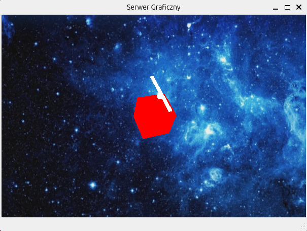

# Mobile Robot Command Interpreter 🚁

This repository contains the final project developed for the **Advanced Programming Methods** (*Zaawansowane Metody Programowania*) course at **Wrocław University of Science and Technology**.

The goal of the project was to create a flexible interpreter for a scripting language capable of controlling a swarm of mobile objects (e.g., drones, helicopters) defined in an XML configuration file. The application operates as a **TCP client**, sending command frames to an external 3D graphic server for real-time visualization.

*Fig 1. Visualization of a mobile robot (helicopter) in the graphic server environment.*

## 🎯 Project Overview

The application is designed with a modular architecture enabling dynamic extension of functionality. Key features include:

1.  **XML Scene Configuration:** The initial state of the scene (objects, parameters) and the list of required plugins are loaded from an XML file using the **Xerces-C++** parser.
2.  **Dynamic Plugin Loading:** Commands (such as `Move`, `Rotate`, `Pause`) are implemented as dynamic shared libraries (`.so` files). The interpreter loads them at runtime using the `dlopen`/`dlsym` mechanism, allowing for easy extensibility without recompiling the core kernel.
3.  **Command Execution:** The interpreter processes a script file, executing commands on specific mobile objects.
4.  **Network Communication:** State updates are transmitted to a visualization server via TCP sockets.

## 🛠️ Tech Stack & Concepts

The project demonstrates proficiency in advanced C++ and software engineering patterns:
* **Language:** C++ (STL, Smart Pointers).
* **Architecture:** Plugin-based architecture using **Shared Libraries**.
* **Design Patterns:** Command Pattern (abstract `Interp4Command` interface), Factory Pattern, Singleton.
* **Libraries:** `libxerces-c` (XML Parsing), `pthread` (Threading).
* **Communication:** BSD Sockets (TCP/IP).

## 📂 Repository Structure

Based on the project file layout:

* **`src/`** - Core source code (XML parsing logic, main loop, network sender, scene management).
* **`inc/`** - Header files defining interfaces (`AbstractInterp4Command`, `MobileObj`) and data structures (`Vector3D`).
* **`plugin/`** - Source code for dynamic command libraries:
    * `Interp4Move`: Linear movement.
    * `Interp4Rotate`: Angular rotation.
    * `Interp4Pause`: Delay execution.
    * `Interp4Set`: Setting initial object state.
* **`config/`** - Configuration files (`config.xml`) and XSD validation schema (`config.xsd`).
* **`launch.sh`** - Bash script to automate the startup of the graphic server and the interpreter.

## 🚀 Build & Run

### Prerequisites
* Linux OS
* `g++` Compiler
* `libxerces-c-dev` library

### Compilation
The project uses `make` to compile the main executable and all plugin libraries.

### Execution
To launch the entire system (including the graphic server, if configured):

      ./launch.sh

📜 Configuration Example (XML)
   
The config.xml file defines the active plugins and the objects in the scene:

<Scene>
  <Lib Name="libInterp4Move.so"/>
  <Lib Name="libInterp4Rotate.so"/>
  
  <Object Name="Helicopter_1" RGB="255 0 0">
     <Shape Type="Cube" Scale="10 20 30" RGB="255 0 0"/>
  </Object>
</Scene>

🎓 Credits
Project Author: Antoni Piałucha 
Base Code & Supervision: Dr inż. Bogdan Kreczmer (Wrocław University of Science and Technology).
--
Educational materials provided for the course included the foundational code for XML parsing, vector mathematics, and the plugin interface skeleton.
